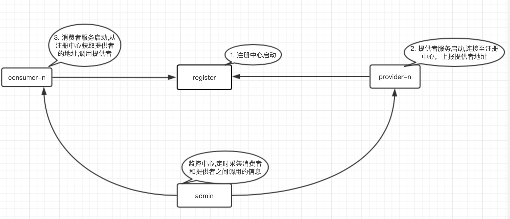
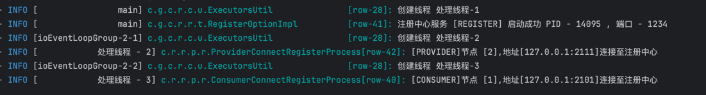
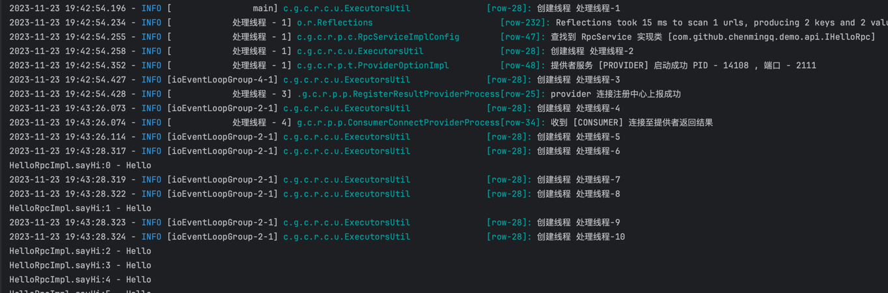
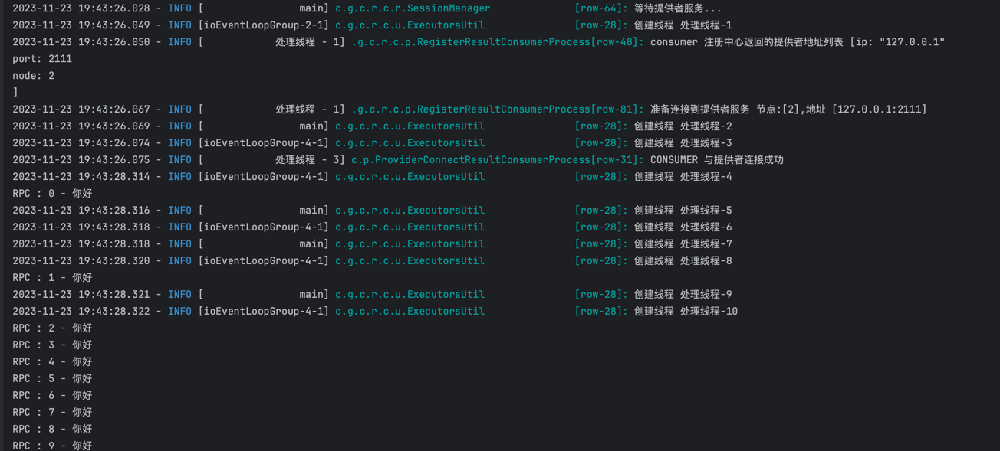

### 该项目利用空闲时间 用来简单学习rpc使用

---



1. 连接到注册中心使用 [protobuf](https://github.com/protocolbuffers/protobuf) 序列化传输
2. 消费者与提供者使用 [protostuff](https://github.com/protostuff/protostuff) 序列化传输
3. 网络通信采用 [netty](https://github.com/netty/netty) 实现tcp通信

##### 模块说明

| 模块名称 | 说明 |
| :------:| :------: |
| register | 注册中心 |
| common | 一些公共使用类 |
| api | 暴露在外的接口 |
| provider | 提供调用的服务 |
| consumer | 消费者服务 |
| admin | 监控中心,提供可视化数据展示 |

##### 目录说明

| 目录 | 说明 |
| :------:| :------: |
| protocol | ProtoBuffer的proto文件 |
| release | 打包完成的tar.gz |

##### 注解列表

| 注解名称 | 使用说明 |
| :------:| :------: |
| @RpcService | 类中声明为rpc的类 |

- 打包
###### 如需打包admin模块,需在本地安装nodejs,否则可以屏蔽admin / pom.xml的插件

```shell
mvn clean package
```

- [demo地址](https://github.com/chenmingq/rpc_test_demo)
- 也可以直接在本项目中运行demo
```text
1. 先启动 com.github.chenmingq.rpc.register.RegisterStart 注册中心
2. 进入 demo模块  com.github.chenmingq.demo.consumer.Consumer 启动
3. 进入 demo模块  com.github.chenmingq.demo.provider.Provider 启动 
```
即可测试演示使用
- 注册中心启动

- provider 启动

- consumer 启动



###### jar只在本地nexus上传了

- 消费者使用,引入maven

```xml

<dependencies>
    <dependency>
        <groupId>com.github.chenmingq.rpc.demo.api</groupId>
        <artifactId>api</artifactId>
        <version>1.0-SNAPSHOT</version>
    </dependency>

    <dependency>
        <groupId>com.github.chenmingq.rpc.consumer</groupId>
        <artifactId>consumer</artifactId>
        <version>1.0-SNAPSHOT</version>
    </dependency>
</dependencies>

```

- 提供者者使用,引入maven

```xml

<dependencies>
    <dependency>
        <groupId>com.github.chenmingq.rpc.demo.api</groupId>
        <artifactId>api</artifactId>
        <version>1.0-SNAPSHOT</version>
    </dependency>

    <dependency>
        <groupId>com.github.chenmingq.rpc.provider</groupId>
        <artifactId>provider</artifactId>
        <version>1.0-SNAPSHOT</version>
    </dependency>
</dependencies>
```

- API使用,引入maven

```xml

<dependency>
    <groupId>com.github.chenmingq.rpc.api</groupId>
    <artifactId>api</artifactId>
    <version>1.0-SNAPSHOT</version>
</dependency>
```

---

### 该项目利用空闲时间 简单学习rpc使用,希望一起学习 多多指教